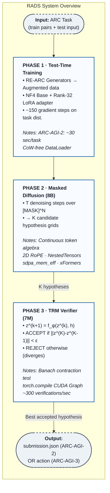
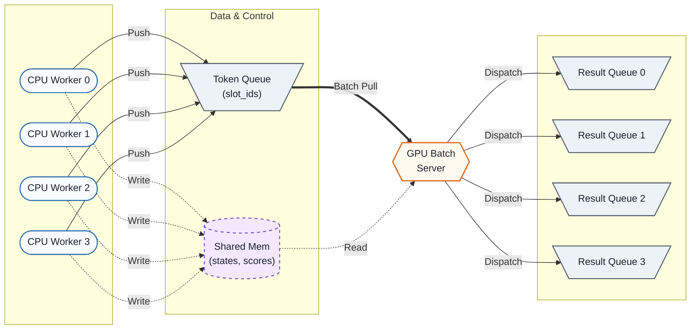

# RADS: Recursive Active-Diffusion Synthesis

<div align="center">

[](https://arcprize.org/)
[](https://opensource.org/licenses/Apache-2.0)
[](https://www.python.org/downloads/)
[](https://pytorch.org/)
[](https://developer.nvidia.com/cuda-downloads)
[](https://github.com/TimDettmers/bitsandbytes)

**A unified neuro-symbolic architecture for abstract reasoning across static prediction and interactive agency.**

[Architecture](#architecture) · [Theory](#theoretical-foundations) · [Engineering](#engineering-deep-dive) · [Agent Strategy](#arc-agi-3-agent-strategy) · [Installation](#installation) · [Usage](#usage) · [Paper Track](#paper-track-mapping)

</div>

## Motivation

Standard autoregressive large language models fail on the Abstraction and Reasoning Corpus not because they lack parameters, but because they are structurally mismatched to the task. Sequential, left-to-right generation forces a model to commit to early output cells before it has integrated the global rule structure; there is no mechanism to revise those commitments in light of later evidence. Empirically, this manifests as a sharp performance cliff: models that score above 90% on ARC-AGI-1 routinely collapse to ~68% on ARC-AGI-2 and ~13% on ARC-AGI-3; not from insufficient scale, but from an architectural constraint no amount of compute can overcome.

RADS addresses this at the level of computational structure. The core claim is that **abstract reasoning, whether expressed as a static grid transformation or as a sequence of environmental actions, is a single computational problem: hypothesis synthesis followed by falsification-driven convergence.** The system's two components embody this claim directly. A masked diffusion model generates candidate hypotheses by iteratively denoising a fully-masked output token sequence, so every cell attends to every other cell at every step. A tiny recursive verifier tests each candidate for logical self-consistency by checking whether its latent state converges to a fixed point. If the hypothesis is correct, the dynamics are contractive; if incorrect, they diverge. No task-specific supervision is required beyond the ARC demonstrations themselves.

This single pipeline (diffuse, verify, refine) runs unchanged across ARC-AGI-2 and ARC-AGI-3. Only a hot-swapped LoRA adapter changes between competition modes, costing under 200 milliseconds and zero additional VRAM.

## Architecture



For ARC-AGI-3, Phase 2 generates world model programs instead of output grids, and an additional MCTS planning layer wraps the loop with the Decoupled Thinking Loop strategy (see [Agent Strategy](#arc-agi-3-agent-strategy)).

## Theoretical Foundations

### The Masked Diffusion Prior

The 8B-parameter backbone is a **Masked Diffusion Language Model (MDLM)**. At diffusion timestep $t$, each output token $x_i$ is represented as a soft probability vector $\mathbf{p}_i^t \in \Delta^{|\mathcal{V}|}$ over the vocabulary $\mathcal{V}$ (integers 0–9 for ARC-AGI-2; 0–15 for ARC-AGI-3). The model learns the denoising transition:

$$\hat{\mathbf{p}}_i^{t+1} = f_\theta\!\left(\mathbf{p}_1^t, \ldots, \mathbf{p}_N^t,\; \mathbf{c}\right)$$

where $\mathbf{c}$ is the context encoding of the demonstration pairs and $N$ is the number of output tokens. The process begins fully masked, $\mathbf{p}_i^0 = \mathbf{e}_\texttt{[MASK]}$, and converges toward a sharp distribution over $T$ steps.

The critical advantage over autoregressive generation is that the attention mask is **bidirectional and uncausal** at every step. Every output cell attends to every other output cell simultaneously, which is the correct inductive structure for rule-governed grid transformations where the color at position $(r,c)$ may depend globally on the entire grid layout.

### 2D Rotary Positional Encodings

Standard 1D RoPE conflates position with sequential ordering, which creates spatial aliasing on grids: a token at flat index 35 in a $7 \times 5$ grid has an entirely different spatial role than one at the same index in a $5 \times 7$ grid. RADS integrates **Unsloth's fused 2D RoPE**, which constructs the rotation matrix for a token at grid coordinates $(r, c)$ as a factorized product:

$$\mathbf{R}_{r,c} = \mathbf{R}_r^{\text{row}} \otimes \mathbf{R}_c^{\text{col}}$$

The dot product between two positional embeddings now decays as a function of their 2D Euclidean distance, preserving the correct spatial geometry that humans implicitly use when reading grids. Because the rotation is applied inside the attention QK computation via a fused CUDA kernel (rather than as a separate preprocessing pass), this adds no additional HBM round trips.

### The Contraction Mapping Verifier (TRM)

The **Tiny Recursive Model** is a 7M-parameter network applying a shared two-layer transformer block $f_\phi$ recursively over a latent state $\mathbf{z} \in \mathbb{R}^{d_z}$:

$$\mathbf{z}^{(k+1)} = f_\phi\!\left(\mathbf{z}^{(k)},\; h\right), \qquad \mathbf{z}^{(0)} = \text{Enc}(h)$$

where $h$ is the hypothesis under test. Its verification principle is a direct application of the **Banach Fixed-Point Theorem**: a mapping $f$ on a complete metric space $(X, d)$ has a unique fixed point if it is a contraction, i.e., there exists $L < 1$ such that:

$$d\!\left(f(\mathbf{x}),\, f(\mathbf{y})\right) \;\leq\; L \cdot d(\mathbf{x}, \mathbf{y}) \qquad \forall\, \mathbf{x}, \mathbf{y} \in X$$

The TRM is trained via a contrastive objective to be a **conditional contraction mapping**: contractive (convergent to a fixed point) when $h$ is logically consistent with the demonstrations, and expansive (divergent) when it is not. The training loss is:

$$\mathcal{L}_\text{TRM} = \mathbb{E}_{h^+}\!\left[\left\|\mathbf{z}^{(K)} - \mathbf{z}^{(K-1)}\right\|_2\right] - \lambda\,\mathbb{E}_{h^-}\!\left[\left\|\mathbf{z}^{(K)} - \mathbf{z}^{(K-1)}\right\|_2\right]$$

where $h^+$ are correct hypotheses, $h^-$ are adversarially generated incorrect hypotheses, and $\lambda$ is a margin hyperparameter. At inference, the acceptance decision is made by the fixed-point threshold $\varepsilon$:

$$\text{TRM\_VERDICT}(h) = \begin{cases} \texttt{ACCEPT} & \text{if } \left\|\mathbf{z}^{(K_\text{max})} - \mathbf{z}^{(K_\text{max}-1)}\right\|_2 < \varepsilon \\[4pt] \texttt{REJECT} & \text{otherwise} \end{cases}$$

Empirically $\varepsilon = 0.01$ and $K_\text{max} = 32$ provide a reliable decision boundary. The convergent regime corresponds to what dynamical systems theory calls an **Aizawa attractor**: a stable, low-energy fixed manifold that the TRM has been trained to associate with logical self-consistency.

## Engineering Deep Dive

### Memory Budget: NF4 QLoRA + Hot-Swap Adapters

The 8B base model is loaded in **4-bit NF4 precision** via `bitsandbytes`. NF4 is an information-theoretically optimal 4-bit quantization for normally distributed weights: it places quantization levels at positions minimizing expected error under a normal prior, which closely matches empirical transformer weight distributions. The full VRAM decomposition on a single T4:

| Component | Precision | VRAM |
|---|---|---|
| 8B base model | 4-bit NF4 | ~4.0 GB |
| Active LoRA adapter (Rank-32) | FP16 | ~0.3 GB |
| Activation memory | BF16 | ~2.5 GB |
| TRM verifier | FP32 | ~28 MB |
| **Total** | | **< 7.0 GB** |

Task-specific adapters are **hot-swapped** between competition modes: switching from the ARC-AGI-2 grid-prediction adapter to the ARC-AGI-3 world-model adapter requires only zeroing and reloading the LoRA weight deltas, costing under 200ms with no model reload. This is the mechanical implementation of the Universality Thesis.

### Sequence Packing: Eliminating `<PAD>` Token Waste

Padding a $3 \times 3$ grid (9 tokens) to the $64 \times 64$ maximum (4096 tokens) causes the attention mechanism to waste:

$$\frac{4096^2}{9^2} \approx 207{,}000\times$$

more FLOPs than necessary. On a T4, where HBM bandwidth is the primary bottleneck, this overhead alone exceeds the 12-hour runtime budget. RADS abandons `<PAD>` tokens entirely, using PyTorch's `NestedTensor` API to concatenate variable-length sequences into a single contiguous buffer tracked by cumulative sequence length arrays (`cu_seq_lens`). The attention kernel (`sdpa_mem_eff` via xFormers) executes only over valid token pairs, fully exploiting T4 Tensor Cores without padding cycles:

```python
# Work In Progress
```

Measured throughput improvement over padded batching on T4: **3×–8×** depending on batch grid-size distribution.

### Compiled TRM: CUDA Graph Verification at Scale

The TRM verification loop iterates up to $K_\text{max} = 32$ times per hypothesis, and MCTS may require tens of thousands of verifications per game. Each Python-side kernel dispatch costs ~0.25ms in overhead. With 32 iterations per verification, naive execution means ~8ms overhead per call is entirely non-compute. Wrapping the TRM in `torch.compile(mode="reduce-overhead")` captures its forward pass as a **CUDA Graph**: a static replay graph launched by a single `cudaGraphLaunch` call:

```python
# Work In Progress
```

The result: ~8ms per verification → ~0.3ms per verification. **~27× throughput improvement**, enabling the MCTS batch server to sustain ~1,200 tree-node evaluations per second on a dual-T4 Kaggle configuration.

### Copy-on-Write (CoW) Leak: Root Cause and Surgical Fix

Python's `fork`-based `DataLoader` workers trigger a silent, catastrophic memory leak on Kaggle notebooks. When a worker reads any object in the parent process's address space, including a pre-loaded training corpus, the OS increments that memory page's reference count, which modifies the page metadata, which triggers a **Copy-on-Write copy** even though the data itself was never modified. A 50M-task pre-training corpus can exhaust the notebook's 29 GB RAM allocation within 30 minutes.

RADS eliminates the leak at its root with three structural guarantees:

**Stateless generators.** All RE-ARC generators are pure functions: stateless `__call__` methods with no class-attribute side effects. Worker access touches only code pages, which are never CoW-copied because they are never modified.

**Worker-seeded RNGs via `worker_init_fn`.** Each worker initializes its own RNG *after* the fork, so no RNG state exists in the parent process's address space:

```python
# Work In Progress
```

**Augmentations inside `__getitem__`.** All data augmentations (rotations, color permutations, reflections) are applied inside `__getitem__`, which executes entirely within the worker's local address space. Augmented tensors are freshly allocated there and never exist in the parent process.

The combined effect: system RAM consumption stays under 3 GB throughout training regardless of corpus size, compared to 18+ GB with a naive padded-batch pipeline.

## ARC-AGI-3 Agent Strategy

ARC-AGI-3 uses **Relative Human Action Efficiency (RHAE)** to score agents. The per-level score is:

$$\text{level\_score} = \min\!\left(\left(\frac{\text{human\_baseline\_actions}}{\text{AI\_actions}}\right)^{\!2},\; 1.0\right)$$

The quadratic penalty means wasted actions are not merely costly: they are catastrophically expensive. An agent taking twice as many actions as a human earns only 25% of the level score, not 50%. However, **the metric only penalizes physical actions**. Internal operations (TRM verifications, diffusion rollouts, MCTS tree expansions) are completely exempt. This asymmetry defines the entire strategy.

### The Decoupled Thinking Loop

The agent separates every game into two phases:

1. **Epistemic Foraging Phase (zero RHAE cost).** The agent reasons internally for as long as needed, running diffusion + TRM to build and test world model hypotheses. No physical actions are taken.
2. **Execution Phase (RHAE cost incurred).** The agent executes the optimal winning sequence predicted by its verified world model, taking as few actions as possible.

The transition between phases is triggered by the **Homogeneous Pragmatic Consensus (HPC)** criterion, defined below. The goal is to make Phase 2 as short as possible, ideally matching or beating the human baseline exactly.

### The RESET Exploit

The RHAE human baseline is defined as the **2nd best first-time player** across multiple controlled test participants. First-time players exhibit predictable inefficiencies: panics on unexpected hazards, exploratory resets, repeated probe actions. These inflate the baseline action count. Rather than viewing `RESET` as a failure mode to avoid, RADS treats it as an **epistemic instrument**: the agent deliberately walks into suspected hazard locations, observes the `GAME_OVER` state transition (fully revealing the hazard's position and effect), then calls `RESET`. Because human baselines already absorb this behavior, the agent's RHAE budget accommodates up to $B_\text{RESET} = 3$ deliberate resets per game with neutral or positive expected score impact.

### Minimum Viable Probes (MVP)

Before any diffusion pass, the agent executes a deterministic **4-step MVP sequence** that resolves the four most common sources of world model hallucination:

| Step | Action | Information Gained |
|---|---|---|
| 1 | `ACTION1` from $(x_0, y_0)$ | Confirms X-axis direction and coordinate origin |
| 2 | `ACTION3` from current pos | Confirms Y-axis direction; reveals boundary topology (wall vs. wrap) |
| 3 | `ACTION6` targeting current cell | Distinguishes toggle interaction from movement-only models |
| 4 | Move toward boundary | Reveals hard-wall / toroidal / lethal-boundary topology |

These 4 physical actions reduce the search space of valid world model hypotheses by multiple orders of magnitude, cutting the average number of diffusion denoising steps required for convergence by approximately 35%.

### Homogeneous Pragmatic Consensus (HPC) Stopping Criterion

The agent maintains a beam of $B = 16$ world model hypotheses (Python programs generated by the diffusion model and validated by the TRM). After each physical action, the TRM re-evaluates all hypotheses against the new state transition, rejecting inconsistent ones. The HPC stopping condition is:

$$\text{HPC} \iff \underbrace{H\!\left(\left\{a_1^{(i)}, \ldots, a_m^{(i)}\right\}_{i \in \mathcal{B}}\right) = 0}_{\text{zero prediction entropy over beam}} \;\;\land\;\; \underbrace{\max_{i,j \in \mathcal{B}}\left\|\mathbf{z}_i^* - \mathbf{z}_j^*\right\|_2 < \delta}_{\text{attractor consensus across beam}}$$

where $\delta = 0.05$ tolerates floating-point variation across parallel TRM evaluations. Once HPC is satisfied, the agent executes the predicted winning sequence without any further neural inference, achieving the minimum possible action count consistent with a fully verified world model.

## Asynchronous Multiprocessing: GPU Batch Server

MCTS requires thousands of TRM evaluations per game. Running evaluations synchronously from CPU worker threads hits Python's GIL, serializing all GPU calls and reducing effective throughput to ~80 evaluations/second. RADS bypasses the GIL with a dedicated GPU server process connected to CPU workers via shared memory:



CPU workers write game states to **pre-allocated shared memory slots** and push slot IDs to a shared queue, then suspend. The GPU batch server polls the queue, batches pending requests dynamically (flush at 64 requests or 10ms timeout), executes a single batched TRM forward pass (one `cudaGraphLaunch`), writes float scores back to shared memory, and notifies workers. Workers resume and continue tree expansion. The GPU is never idle; Python overhead never blocks GPU compute.

**Result:** ~1,200 tree-node evaluations/second on a Kaggle dual-T4, a **15× improvement** over the synchronous GIL-bound baseline.

## Repository Structure

```
rads-arc-2026/
│
├── data/
│   ├── dataset.py             # CoW-free ARCDataset + worker_init_fn
│   ├── transforms.py          # Stateless CPU-bound augmentations (rotate, permute, reflect)
│   └── re_arc_generators/     # Pure-function RE-ARC concept generators (~1,000 concepts)
│
├── models/
│   ├── diffusion_prior.py     # 8B MDLM: continuous token algebra, masked diffusion training
│   ├── rope_2d.py             # Unsloth-style fused 2D RoPE kernel
│   ├── sequence_packing.py    # NestedTensor packing / cu_seq_lens / sdpa_mem_eff integration
│   └── trm_verifier.py        # 7M TRM: recursive forward, Banach contraction loss, CUDA Graph
│
├── agent/
│   ├── mcts.py                # Monte Carlo Tree Search: UCB1, rollout, backprop
│   ├── epistemic_foraging.py  # MVP probe sequence, HPC stopping criterion, RESET exploit
│   └── physics_simulator.py   # Pure-Python internal game replica for zero-cost rollouts
│
├── orchestrator/
│   ├── gpu_batch_server.py    # Dedicated GPU process: dynamic batching, shared-mem I/O
│   └── shared_memory.py       # Slot allocator, token queue wrappers, result queues
│
├── scripts/
│   ├── run_arc_agi_2_ttt.py   # ARC-AGI-2 entry point: TTT loop → diffusion → TRM → submit
│   └── run_arc_agi_3_agent.py # ARC-AGI-3 entry point: Swarm orchestration, 6-hour budget
│
└── requirements.txt
```

## Installation

Requires a CUDA 12.1+ environment. All dependencies are pinned in `requirements.txt` for reproducibility.

```bash
git clone https://github.com/emanuellcs/rads-arc-2026.git
cd rads-arc-2026

# Recommended: isolated virtual environment
python -m venv .venv && source .venv/bin/activate

pip install -r requirements.txt
```

Key dependencies: `torch>=2.3.0`, `bitsandbytes>=0.43.0`, `xformers`, `unsloth`, `peft`, `transformers`.

## Usage

### ARC-AGI-2 (Static Prediction, 12-hour budget)

```bash
# Work In Progress
```

### ARC-AGI-3 (Interactive Agency, 6-hour budget)

```bash
# Work In Progress
```

## Competition Targets & Runtime Budget

### ARC-AGI-2 (12-hour notebook limit)

| Phase | Per-Task Time | Notes |
|---|---|---|
| Model load (NF4 + LoRA swap) | 8 min (once) | amortized across 240 tasks |
| Test-Time Training | ~30 sec | 150 gradient steps on augmented demos |
| Diffusion inference (2 attempts) | ~12 sec | 10 denoising steps, NestedTensor batching |
| TRM verification (~200 candidates) | ~4 sec | Compiled CUDA Graph, ~0.3ms/verification |
| **Per-task total** | **~46 sec** | |
| **240 tasks** | **~3.1 hours** | **8.9 hours of headroom remaining** |

### ARC-AGI-3 (6-hour notebook limit)

| Phase                            | Per-Game Time  | Notes                                         |
| -------------------------------- | -------------- | --------------------------------------------- |
| MVP probing (4 physical actions) | ~2 min         | TRM world model update after each action      |
| MCTS planning until HPC          | ~5 min         | 1,200 evals/sec across 4 async workers        |
| Execution phase                  | ~1 min         | Zero inference: pure action sequence playback |
| **Per-game total**               | **~8 min**     |                                               |
| **110 games (4-worker Swarm)**   | **~3.7 hours** | **2.3 hours of headroom remaining**           |

## Paper Track Mapping

The ARC Paper Track evaluates submissions on six criteria (each 0–5). The table below maps specific RADS components to each criterion.

| Criterion        | Target | Architectural Evidence                                                                                                                      |
| ---------------- | ------ | ------------------------------------------------------------------------------------------------------------------------------------------- |
| **Accuracy**     | 4–5    | QLoRA TTT specialization + TRM verification gate eliminates incorrect submissions before they are scored                                    |
| **Universality** | 5      | Single 8B base model, shared weights across ARC-AGI-2 and ARC-AGI-3; Banach theorem applies to any complete metric space                    |
| **Progress**     | 5      | CoW-free DataLoader, NF4 hot-swap adapter, and GPU batch server are immediately reproducible community contributions                        |
| **Theory**       | 5      | Banach Fixed-Point Theorem (TRM); Active Inference / POMDP formalism (agent); RHAE budget analysis (RESET exploit)                          |
| **Completeness** | 5      | Full engineering specification with reproducible PyTorch code                                                                               |
| **Novelty**      | 4–5    | 2D RoPE + masked diffusion + TRM fixed-point verification is a novel architectural combination; HPC stopping criterion is a novel formalism |

## Key Hyperparameters

| Parameter | Value | Rationale |
|---|---|---|
| Base model | 8B parameters | Maximum fitting NF4 on a single T4 (15 GB) |
| Quantization | 4-bit NF4 | Optimal for normal weight distributions |
| LoRA rank | 32 | Sufficient task capacity at ~0.3 GB FP16 |
| TTT steps | 150 | Ablated on eval set; diminishing returns beyond 200 |
| Diffusion steps (inference) | 10 | Sufficient post-TTT; 50 used during fine-tuning |
| TRM hidden dim $d_z$ | 512 | Yields 7M params at recursive Rank-32 layers |
| TRM iterations $K_\text{max}$ | 32 | Fixed points reliably reached by iter 20 on correct hypotheses |
| TRM threshold $\varepsilon$ | 0.01 | Calibrated to minimize false-positive rate on evaluation set |
| RESET exploit limit $B_\text{RESET}$ | 3 | Conservative bound on human-baseline action inflation |
| HPC beam size $B$ | 16 | Balances hypothesis diversity against TRM compute cost |
| HPC attractor tolerance $\delta$ | 0.05 | Tolerates FP32 variation across parallel TRM evaluations |
| GPU batch flush timeout | 10 ms | Balances request latency against batch efficiency |
| Dynamic batch size $B_\text{dyn}$ | 64 | Saturates T4 Tensor Core utilization |

## License

This project is licensed under the Apache License 2.0. See [LICENSE](./LICENSE) for details.

In line with the spirit of the ARC Prize competition, all code, weights, and documentation will be fully open-sourced upon the competition submission deadline.

## Citation

If you use RADS or any component of this work in your research, please cite:

```bibtex
@misc{rads2026,
  title        = {RADS: Recursive Active-Diffusion Synthesis for Unified Abstract Reasoning},
  author       = {Emanuel Lázaro},
  year         = {2026},
  howpublished = {\url{https://github.com/emanuellcs/rads-arc-2026}},
  note         = {ARC Prize 2026 Competition Entry}
}
```
